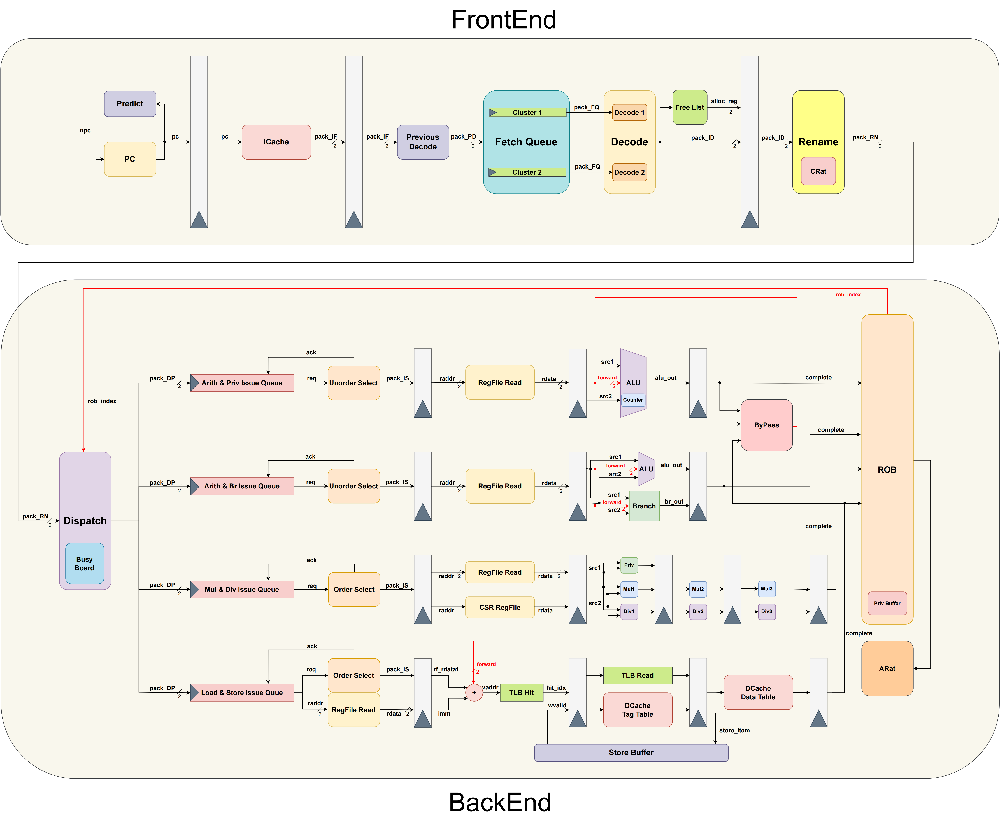

# **Zircon-Core 2023**

## **总体介绍**
本项目的处理器基于Tomasulo旁路算法，采用11或12级流水、多发射、乱序执行、顺序提交的方式进行构建。该处理器支持龙芯架构32位精简版指令集除IBAR和DBAR外的全部指令，可以稳定运行功能测试和性能测试，最大时钟频率达120MHz，运行CoreMark通用测试程序的IPC达0.834，系统运行稳定性有待测试验证。

按照指令流动的方式，该处理器的流水级可划分为：

* 前端：预取指、取指、预译码、译码、重命名
* 后端：发射、读寄存器堆、执行（地址转换、访存）、写回、提交

在前端中，指令保持程序中原有顺序流动，并在重命名阶段被打乱送入对应的功能单元发射队列。后端使用重排序缓存维护指令原有顺序，并通过乱序多发射的思想尽可能挖掘指令间的并行性。

## **指令支持**

处理器支持龙芯架构32位精简版指令集中运行系统所需的全部指令，包括：

- **非特权架构**：
    - 算数运算类指令：`ADD.W`, `SUB.W`, `ADDI.W`, `LU12I.W`, `SLT[U]`, `SLT[U]I`, `PCADDU12I`, `AND`, `OR`, `NOR`, `XOR`, `ANDI`, `ORI`, `XORI`, `MUL.W`, `MULH.W[U]`, `DIV.W[U]`, `MOD.W[U]`
    - 移位运算类指令：`SLL.W`, `SRL.W`, `SRA.W`, `SLLI.W`, `SRLI.W`, `SRAI.W`
    - 转移指令：`BEQ`, `BNE`, `BLT[U]`, `BGE[U]`, `B`, `BL`, `JIRL`
    - 普通访存指令：`LD.B`, `LD.H`, `LD.W`, `LD.BU`, `LD.HU`, `ST.B`, `ST.H`, `ST.W`
    - 其他杂项指令：`RDCNTVL.W`, `RDCNTVH.W`, `RDCNTID`, `SYSCALL`, `BREAK`
- **特权架构**：
    - CSR访问指令：`CSRRD`, `CSRWR`, `CSRXCHG`
    - Cache维护指令：`CACOP`
    - TLB维护指令：`TLBSRCH`, `TLBRD`, `TLBWR`, `TLBFILL`, `INVTLB`
    - 其他杂项指令：`ERTN`

由于IBAR和DBAR的功能一般使用CACOP代为实现，故处理器未支持该指令。

