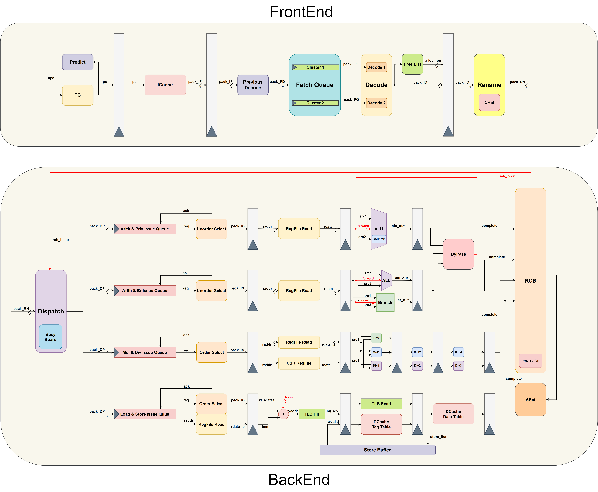

# **Zircon RISC-V 处理器设计**

## **Zircon-Core系列简介**

Zircon-Core系列处理器是基于RISC系列指令集设计的超标量处理器，目前包含Zircon-Core 2023和Zircon-Core 2024两个版本。该系列处理器旨在探索处理器敏捷设计方法，通过模块化设计和参数化配置，快速实现并验证学术界处理器设计算法和思想，并结合工业界处理器设计方法，探索处理器设计新范式。

???+ tip "**Chisel编程语言**"
    
    ### **Chisel语言简介**  
    Chisel是Scala语言的一个库，它是一种用于硬件设计的领域特定语言，它将硬件设计的高级描述与硬件描述语言（HDL）的低级实现相结合。Chisel语言通过模块化、参数化设计，使得硬件设计更加灵活和可重用。Chisel语言的语法类似于Scala编程语言，具有以下特点：

    1. **模块化设计**：Chisel通过模块化设计，将硬件设计分解为多个模块，每个模块可以独立设计和测试。
    2. **参数化设计**：Chisel允许开发者定义参数，通过参数化设计，可以快速生成不同的硬件设计。
    3. **类型系统**：Chisel具有类型系统，可以进行类型检查和类型推断，避免类型错误。
       
    了解更多Chisel语言的使用方法，可以参考[Chisel语言官方文档](https://www.chisel-lang.org)。

## **系列作品简介**
### **Zircon-Core 2023**
Zircon-Core 2023是Zircon系列处理器的处女座，也是作者首次系统性使用Chisel独立开发超标量处理器的编程实践。该处理器基于Loongarch 32bit Reduced指令集开发，实现了该指令集中除IBAR和DBAR之外的全部指令和特权架构。

???+ info "**开源仓库**"
    该处理器已经在[Github](https://github.com/MaZirui2001/Zircon)开源，欢迎业界同仁批评指正。

???+ success "**获奖情况**"
    作者以该处理器设计为基础，完成了中国科学技术大学2024年本科毕业论文《基于龙芯架构32位精简版指令集的超标量处理器设计》论文。该论文获得了以下荣誉：

    - **2024年中国科学技术大学本科优秀毕业论文**
    - **2024年安徽省计算机学会省级优秀毕业论文**

### **Zircon-Core 2024**

Zircon-Core 2024是Zircon系列的第二代产品，作者在总结并吸取一代产品的开发经验和教训的基础上，基于RISC-V 32位指令集开发了全新的超标量处理器，实现了RV32IM指令集中的全部指令。

???+ info "**开发日程**"
    目前该处理器已经通过仿真基本验证了指令的正确性，并在CoreMark性能测试中获得了1.04的IPC。

## **鸣谢**
特别感谢所有为本处理器开发建言献策的所有老师和同学们，感谢你们的辛勤付出和宝贵建议。

部分名单如下：

- **中国科学院计算技术研究所**：
  - 教师：叶笑春、李文明、吴海彬

- **中国科学技术大学**：
  - 教师：卢建良、张俊霞、樊彦恩、赵雅楠
  - 学生：张子辰、徐航宇
